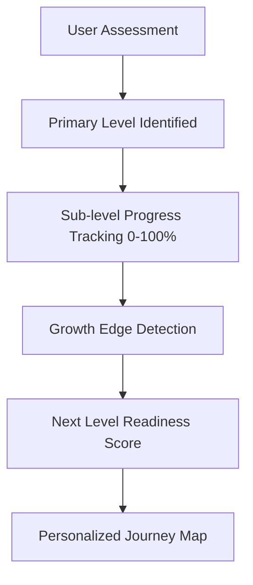
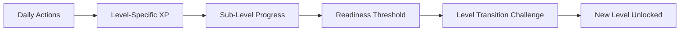
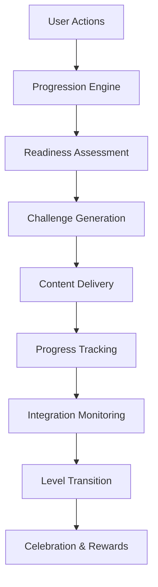

# 🌀 Spiral Dynamics Progression System - Complete Integration Plan

## 🎯 **Core Vision: The Spiral Journey Engine**

Transform the field manual's "Mechanics of Moving Up" into an intelligent, gamified progression system that automatically guides users through their developmental journey with simple, engaging, and almost automatic progression.

---

## **📋 Detailed Implementation Plan**

### **Phase 1: Enhanced Spiral Dynamics Foundation**

#### **1.1 Expand Current Level Detection**


#### **1.2 Create Progression Mechanics Database Schema**
```sql
-- New tables for progression tracking
CREATE TABLE spiral_journey_states (
  id UUID PRIMARY KEY,
  profile_id UUID REFERENCES profiles(id),
  current_step INTEGER, -- 1-6 for the mechanics
  step_progress INTEGER, -- 0-100
  readiness_signals JSONB,
  problem_pressure_score INTEGER,
  cognitive_bandwidth_score INTEGER,
  window_opportunity_open BOOLEAN,
  next_level_glimpses_count INTEGER,
  supportive_container_strength INTEGER,
  practice_integration_score INTEGER,
  created_at TIMESTAMPTZ DEFAULT NOW(),
  updated_at TIMESTAMPTZ DEFAULT NOW()
);

CREATE TABLE growth_challenges (
  id UUID PRIMARY KEY,
  spiral_level TEXT NOT NULL,
  target_step INTEGER, -- Which of the 6 steps this addresses
  challenge_type TEXT NOT NULL,
  title TEXT NOT NULL,
  description TEXT NOT NULL,
  upgrade_tools JSONB,
  xp_reward INTEGER,
  difficulty_level INTEGER,
  estimated_time TEXT,
  success_criteria JSONB,
  created_at TIMESTAMPTZ DEFAULT NOW()
);

CREATE TABLE progression_triggers (
  id UUID PRIMARY KEY,
  profile_id UUID REFERENCES profiles(id),
  trigger_type TEXT NOT NULL, -- 'problem_pressure', 'bandwidth_ready', etc.
  trigger_data JSONB,
  is_active BOOLEAN DEFAULT TRUE,
  created_at TIMESTAMPTZ DEFAULT NOW()
);

CREATE TABLE level_transitions (
  id UUID PRIMARY KEY,
  profile_id UUID REFERENCES profiles(id),
  from_level TEXT NOT NULL,
  to_level TEXT NOT NULL,
  transition_date TIMESTAMPTZ DEFAULT NOW(),
  preparation_duration INTERVAL,
  integration_score INTEGER,
  success_indicators JSONB
);
```

### **Phase 2: The 6-Step Progression Engine**

#### **2.1 Step 1: Problem-Pressure Detection**
- **Smart Challenge Generator**: Creates appropriate "problems" that stretch current capacity
- **Life Condition Monitoring**: Tracks when current strategies aren't working
- **Gentle Pressure Points**: Introduces complexity gradually through daily tasks
- **Pressure Calibration**: Ensures challenges are stretching but not overwhelming

**Implementation:**
```typescript
interface ProblemPressureDetector {
  detectStagnation(): boolean
  generateAppropriateChallenge(level: SpiralLevel): Challenge
  calibratePressure(userCapacity: number): number
  monitorLifeConditions(): LifeCondition[]
}
```

#### **2.2 Step 2: Cognitive Bandwidth Assessment**
- **Stress Level Monitoring**: Integrates with health metrics to ensure optimal learning state
- **Capacity Indicators**: Tracks sleep, energy, and completion rates
- **Window Detection**: Identifies when user has bandwidth for growth
- **Recovery Tracking**: Monitors when user needs rest vs. challenge

**Implementation:**
```typescript
interface CognitiveBandwidthAssessor {
  assessCurrentCapacity(): number
  predictOptimalGrowthWindows(): TimeWindow[]
  monitorStressIndicators(): StressLevel
  recommendRecoveryActions(): Action[]
}
```

#### **2.3 Step 3: Window of Opportunity Recognition**
- **Readiness Signals**: Detects patterns indicating openness to change
- **Optimal Timing**: Suggests growth activities when conditions are right
- **Safety Net**: Ensures user feels secure before introducing challenges
- **Momentum Detection**: Identifies when user is in flow state for growth

#### **2.4 Step 4: Next Level Glimpses**
- **Micro-Exposures**: Gradually introduces next-level concepts through content
- **Role Model Stories**: Shares examples of people operating at the next level
- **Perspective Shifts**: Offers gentle challenges to current worldview
- **Curiosity Cultivation**: Creates intrigue about higher-level capabilities

#### **2.5 Step 5: Supportive Container Creation**
- **Community Features**: Connects users with others at similar developmental stages
- **Mentorship Matching**: Suggests coaches/mentors aligned with next level
- **Safe Practice Spaces**: Creates low-risk environments to try new approaches
- **Peer Support Networks**: Facilitates connections with growth-oriented individuals

#### **2.6 Step 6: Practice & Integration**
- **Habit Formation**: Converts insights into daily practices
- **Progress Tracking**: Monitors integration of new capacities
- **Celebration Milestones**: Recognizes successful integration
- **Mastery Indicators**: Tracks when new level becomes natural

### **Phase 3: Gamification Layer**

#### **3.1 The Spiral XP System**


**XP Categories:**
- **Foundation XP**: Basic level maintenance and stability
- **Growth Edge XP**: Activities that stretch current capacity
- **Integration XP**: Successfully incorporating new insights
- **Mastery XP**: Demonstrating consistent new-level behavior
- **Transition XP**: Successfully moving to next level

#### **3.2 Progressive Unlock System**
- **Level Gates**: Each level unlocks new features, content, and challenges
- **Mastery Indicators**: Clear progress bars for each developmental aspect
- **Achievement Badges**: Recognize specific growth milestones
- **Capability Unlocks**: New tools and features become available

**Unlock Progression:**
```
Red Level Unlocks:
- Power challenges and competitions
- Respect-building activities
- Immediate win celebrations
- Authority introduction exercises

Blue Level Unlocks:
- Structure-building tools
- Purpose-alignment features
- Rule-based challenges
- Duty and service activities

Orange Level Unlocks:
- Achievement tracking systems
- Competitive leaderboards
- Efficiency optimization tools
- Success metrics dashboards

Green Level Unlocks:
- Community building features
- Consensus decision tools
- Relationship quality trackers
- Empathy development exercises

Yellow Level Unlocks:
- Systems thinking challenges
- Integration project tools
- Complexity navigation aids
- Meta-cognitive exercises

Turquoise Level Unlocks:
- Global awareness features
- Unity consciousness practices
- Holistic integration tools
- Transpersonal development aids
```

#### **3.3 Adaptive Challenge System**

**Level-Specific Challenge Types:**

**Red Level Challenges:**
- Power-building exercises (martial arts tracking, strength goals)
- Competition-based activities (leaderboards, contests)
- Immediate gratification rewards (quick wins, instant feedback)
- Respect-earning activities (leadership moments, assertiveness practice)

**Blue Level Challenges:**
- Structure-creation tasks (routine building, organization systems)
- Rule-following exercises (discipline tracking, commitment keeping)
- Purpose-alignment activities (mission statement creation, value clarification)
- Service-oriented challenges (helping others, duty fulfillment)

**Orange Level Challenges:**
- Achievement-focused goals (measurable targets, KPI tracking)
- Optimization exercises (efficiency improvements, process enhancement)
- Strategic thinking tasks (planning, analysis, decision-making)
- Success celebration activities (milestone recognition, progress sharing)

**Green Level Challenges:**
- Community-building activities (relationship strengthening, group participation)
- Consensus-seeking exercises (collaborative decision-making, conflict resolution)
- Empathy development tasks (perspective-taking, emotional intelligence)
- Inclusivity practices (diversity appreciation, cultural awareness)

**Yellow Level Challenges:**
- Systems thinking exercises (complexity navigation, pattern recognition)
- Integration projects (connecting disparate elements, synthesis tasks)
- Meta-cognitive activities (thinking about thinking, awareness practices)
- Adaptive problem-solving (flexible approach development, context sensitivity)

### **Phase 4: Smart Content Delivery**

#### **4.1 Level-Appropriate Content Engine**
- **Dynamic Suggestions**: AI coach adapts language and approach to current level
- **Growth Edge Content**: Gradually introduces next-level concepts
- **Regression Support**: Provides appropriate support during stress-induced downshifts
- **Personalization**: Tailors content to individual interests and learning style

#### **4.2 Upgrade Tools Integration**

**Red → Blue Transition Tools:**
- Martial arts or sports tracking for channeling power constructively
- Respect-building challenges that introduce authority concepts
- Clear external rules with firm consequences
- Mentoring by respected authority figures

**Blue → Orange Transition Tools:**
- Introduction of objective metrics and science-based approaches
- Entrepreneurial role-model stories and case studies
- Safe experiments that reward individual initiative
- Strategic thinking exercises and business simulations

**Orange → Green Transition Tools:**
- Diversity encounters without zero-sum framing
- Values-based leadership programs and community service
- Travel experiences that reveal systemic costs of pure achievement
- Relationship-building activities that show interdependence

**Green → Yellow Transition Tools:**
- Systems thinking courses and complexity games
- Agile/scrum methodologies that use roles not rigid ranks
- Exposure to integrative leaders who blend metrics and empathy
- Serious systems simulations and scenario planning

**Yellow → Turquoise Transition Tools:**
- Advanced contemplative practices and meditation
- Complexity games and systems simulations
- Masterminds with other integrative thinkers
- Global stewardship projects and environmental awareness

---

## **🎮 User Experience Flow**

### **Daily Experience**
1. **Morning Readiness Check** (2 minutes)
   - Brief assessment of current state and energy
   - Personalized challenge selection based on capacity
   - Intention setting for growth activities

2. **Adaptive Challenges** (15-30 minutes)
   - 2-3 level-appropriate tasks that gently stretch capacity
   - Real-time difficulty adjustment based on performance
   - Immediate feedback and encouragement

3. **Progress Celebration** (2 minutes)
   - Recognition of growth and integration
   - XP rewards and achievement unlocks
   - Positive reinforcement and momentum building

4. **Evening Integration** (5 minutes)
   - Reflection on insights and learning
   - Planning for tomorrow's growth activities
   - Gratitude and appreciation practice

### **Weekly Progression**
1. **Growth Edge Assessment**
   - Evaluation of readiness for next-level exposure
   - Identification of emerging capacities and blind spots
   - Calibration of challenge difficulty and support needs

2. **Challenge Escalation**
   - Gradual increase in complexity and scope
   - Introduction of new concepts and perspectives
   - Expansion of comfort zone boundaries

3. **Community Connection**
   - Opportunities to engage with others at similar levels
   - Peer support and accountability partnerships
   - Shared learning and growth experiences

4. **Integration Review**
   - Consolidation of new capacities and insights
   - Identification of successful practices and habits
   - Planning for continued development

### **Monthly Evolution**
1. **Level Transition Evaluation**
   - Comprehensive assessment of readiness for next level
   - Review of the 6-step progression through current level
   - Identification of remaining integration needs

2. **Comprehensive Review**
   - Analysis of growth patterns and developmental trends
   - Recognition of achievements and milestones
   - Identification of areas needing attention

3. **Journey Mapping**
   - Updated visualization of developmental progress
   - Projection of future growth trajectory
   - Celebration of transformation and evolution

4. **Goal Recalibration**
   - Adjustment of targets based on current capacity
   - Alignment of activities with developmental priorities
   - Setting intentions for continued growth

---

## **🛠 Technical Implementation Strategy**

### **Component Architecture**
```
src/components/spiral-journey/
├── progression-engine/
│   ├── step-tracker.tsx          # Tracks 6-step progression
│   ├── readiness-detector.tsx    # Identifies growth opportunities
│   ├── challenge-generator.tsx   # Creates appropriate challenges
│   └── integration-monitor.tsx   # Tracks practice and mastery
├── gamification/
│   ├── xp-system.tsx            # Experience points and rewards
│   ├── level-progress.tsx       # Visual progress indicators
│   ├── achievement-badges.tsx   # Recognition and celebration
│   └── unlock-system.tsx       # Progressive feature unlocking
├── adaptive-content/
│   ├── level-coach.tsx          # Level-appropriate AI coaching
│   ├── upgrade-tools.tsx        # Transition support tools
│   ├── next-level-glimpses.tsx  # Preview of higher levels
│   └── regression-support.tsx   # Downshift assistance
└── community/
    ├── peer-matching.tsx        # Connect similar-level users
    ├── mentorship.tsx           # Higher-level guidance
    └── support-groups.tsx       # Developmental communities
```

### **AI Integration Points**
- **Readiness Detection**: ML model to identify optimal growth moments
- **Challenge Personalization**: Dynamic content generation based on current state
- **Progress Prediction**: Forecasting of developmental trajectory
- **Intervention Timing**: Smart notifications for growth opportunities
- **Regression Prevention**: Early warning system for stress-induced downshifts

### **Data Flow Architecture**


---

## **🎯 Success Metrics**

### **Engagement Metrics**
- Daily active usage and task completion rates
- Time spent in growth-edge activities
- User retention and progression velocity
- Challenge acceptance and completion rates

### **Developmental Metrics**
- Level transition success rates
- Integration stability (avoiding regression)
- Capacity expansion measurements
- Mastery demonstration frequency

### **Satisfaction Metrics**
- User feedback on challenge appropriateness
- Sense of progress and accomplishment
- Community engagement and support quality
- Overall life satisfaction improvements

### **System Performance Metrics**
- Accuracy of readiness detection
- Effectiveness of challenge personalization
- Prediction accuracy for growth windows
- User progression through 6-step mechanics

---

## **🚀 Implementation Phases**

### **Phase 1 (Weeks 1-2): Foundation Enhancement**
- Enhance spiral dynamics detection and tracking systems
- Build basic progression engine infrastructure
- Create level-specific challenge database
- Implement 6-step tracking mechanism

### **Phase 2 (Weeks 3-4): Core Mechanics Implementation**
- Build the complete 6-step progression system
- Implement adaptive challenge generation
- Create XP and progression tracking systems
- Develop readiness detection algorithms

### **Phase 3 (Weeks 5-6): Gamification Integration**
- Add comprehensive achievement system and badges
- Implement progressive level unlock mechanics
- Create celebration and recognition features
- Build community connection features

### **Phase 4 (Weeks 7-8): Polish & Advanced Features**
- Integrate with existing life levels system
- Add mentorship and peer support features
- Optimize AI coaching for developmental stages
- Implement regression prevention and support

### **Phase 5 (Weeks 9-10): Testing & Refinement**
- Comprehensive user testing and feedback collection
- Algorithm refinement and optimization
- Performance monitoring and improvement
- Launch preparation and documentation

---

## **🔄 Integration with Existing System**

### **Life Levels Enhancement**
Each of the 7 life level categories gets enhanced with spiral-aware features:

1. **Mindset & Maturity**: Core developmental work with level-specific practices
2. **Family & Relationships**: Level-appropriate relationship strategies and communication
3. **Money**: Financial approaches that match current worldview and values
4. **Fitness**: Exercise motivation and approaches aligned with developmental level
5. **Health**: Wellness practices that resonate with current value system
6. **Skill Building**: Learning approaches suited to cognitive development stage
7. **Fun & Joy**: Recreation that fulfills current level's needs and growth edges

### **AI Coach Evolution**
The existing AI coach becomes spiral-aware:
- **Language Adaptation**: Speaks in terms that resonate with current level
- **Challenge Calibration**: Suggests activities appropriate to developmental stage
- **Growth Edge Focus**: Gradually introduces next-level concepts and perspectives
- **Regression Support**: Provides appropriate assistance during stress-induced downshifts

### **Dashboard Integration**
The main dashboard incorporates spiral progression:
- **Spiral Progress Widget**: Visual representation of developmental journey
- **Readiness Indicators**: Shows current capacity for growth challenges
- **Next Level Preview**: Glimpses of upcoming developmental territory
- **Integration Tracker**: Monitors practice and mastery of new capacities

---

This comprehensive plan transforms LifeLevels into an intelligent developmental companion that meets users exactly where they are while gently guiding them toward greater complexity, compassion, and consciousness through the proven mechanics of spiral development.